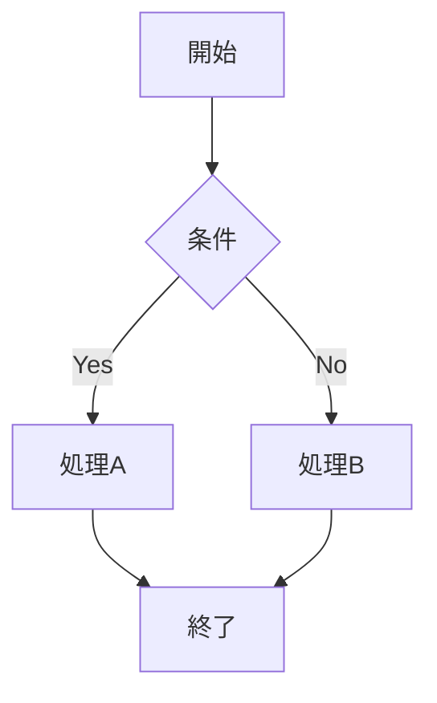

# Markdown Mermaid Viewer

[](https://opensource.org/licenses/MIT)
[](https://code.visualstudio.com/)

VS Code 拡張「**Markdown Mermaid Viewer**」です。Markdown 内の Mermaid 図をプレビューし、**Kindle 本・EPUB/PDF エクスポート**にしっかり対応することを目指しています。

> 🎉 **OSS として公開中！** コントリビューション歓迎です。

## 特徴

- ✅ Markdown 内の Mermaid ブロック（**\`\`\`mermaid**）をプレビュー
- ✅ `.mermaid-config.json` でテーマやスタイルをカスタマイズ
- ✅ 印刷・電子書籍向けの `neutral` テーマをデフォルト採用
- 🚧 EPUB/PDF エクスポート（Phase 2 で対応予定）

## インストール

### VS Code マーケットプレイスから（準備中）

現在開発中のため、マーケットプレイスには未公開です。

### ローカルインストール（開発版）

```bash
# リポジトリをクローン
git clone https://github.com/feel-flow/vscode-markdown-mermaid.git
cd vscode-markdown-mermaid

# 依存インストールとビルド
npm install
npm run compile

# VS Code でデバッグ実行（F5）
```

## 使い方

### 1. Markdown ファイルを開く

`.md` ファイルを VS Code で開きます。

### 2. Viewer を開く

エディタ右上の **「Viewer を開く」** ボタンをクリックします。

または、コマンドパレット（`Ctrl+Shift+P` / `Cmd+Shift+P`）から「**Viewer を開く**」を実行します（「Mermaid」で検索しても見つかります）。

### 3. Mermaid 図がレンダリングされる

**\`\`\`mermaid** ブロックが図として描画されます。

**サンプル Markdown:**

~~~markdown
# ドキュメント

以下は Mermaid のフローチャートです：


~~~

## 設定（.mermaid-config.json）

ワークスペースのルートに `.mermaid-config.json` を配置すると、Mermaid の描画設定をカスタマイズできます。

### 最小例

```json
{
  "theme": "forest"
}
```

### 利用可能なテーマ

| テーマ | 説明 |
|--------|------|
| `default` | Mermaid 標準のカラフルなテーマ |
| `neutral` | モノクロ調、印刷・電子書籍向け（デフォルト） |
| `dark` | ダークモード向け |
| `forest` | 緑系の落ち着いた配色 |
| `base` | カスタマイズ用ベーステーマ |

### カスタムカラー例（base テーマ使用時）

`base` テーマを使用すると、`themeVariables` で色をカスタマイズできます。

```json
{
  "theme": "base",
  "themeVariables": {
    "primaryColor": "#4a90d9",
    "primaryTextColor": "#ffffff",
    "primaryBorderColor": "#2a5a9d",
    "lineColor": "#333333",
    "secondaryColor": "#f0f0f0",
    "tertiaryColor": "#fafafa"
  }
}
```

> **注意**: `themeVariables` は `theme: "base"` のときのみ有効です。他のテーマでは無視されます（Mermaid の仕様）。

### カスタム CSS 例

```json
{
  "theme": "neutral",
  "themeCSS": ".node rect { stroke-width: 2px; }"
}
```

> **セキュリティ**: `themeCSS` で `url()`, `expression()`, `javascript:`, `@import` は使用できません。

## ロードマップ

| Phase | 内容 | 状態 |
|-------|------|------|
| **Phase 1** | Mermaid プレビュー + .mermaid-config.json 対応 | ✅ 完了 |
| **Phase 2** | EPUB/PDF エクスポート（mermaid-filter + Pandoc） | 🚧 予定 |
| **Phase 3** | パフォーマンス最適化、KDP 向け補助機能 | 📋 計画中 |

## 開発者向け情報

### プロジェクト構成

本プロジェクトは [AI Spec Driven Development](https://github.com/FEEL-FLOW/ai-spec-driven-development) の考え方に従い、仕様書を中核に開発を進めています。

### 必読ドキュメント

- **作業開始前**: [docs/MASTER.md](docs/MASTER.md)
- **要件**: [docs/01-context/PROJECT.md](docs/01-context/PROJECT.md)
- **設計**: [docs/02-design/ARCHITECTURE.md](docs/02-design/ARCHITECTURE.md)
- **実装**: [docs/03-implementation/PATTERNS.md](docs/03-implementation/PATTERNS.md), [CONVENTIONS.md](docs/03-implementation/CONVENTIONS.md)
- **用語・判断**: [docs/06-reference/GLOSSARY.md](docs/06-reference/GLOSSARY.md), [DECISIONS.md](docs/06-reference/DECISIONS.md)
- **ロードマップ**: [docs/07-project-management/ROADMAP.md](docs/07-project-management/ROADMAP.md)

### AI ツール（Cursor / Claude / Copilot）を使う場合

ルートの [.cursorrules](.cursorrules) および [AGENTS.md](AGENTS.md) に、MASTER.md 参照とコード生成ルールを記載しています。

### 開発コマンド

```bash
npm install        # 依存インストール
npm run compile    # ビルド（型チェック + esbuild）
npm run watch      # ウォッチモード
npm run package    # 本番ビルド（minify）
```

## コントリビューション

Issue や Pull Request 歓迎です！

1. Fork して `feature/#XX-description` ブランチを作成
2. 変更をコミット（`feat: #XX Add feature` 形式）
3. `develop` ブランチへ PR を作成

詳細は [AGENTS.md](AGENTS.md) の Git Workflow を参照してください。

## ライセンス

MIT License
