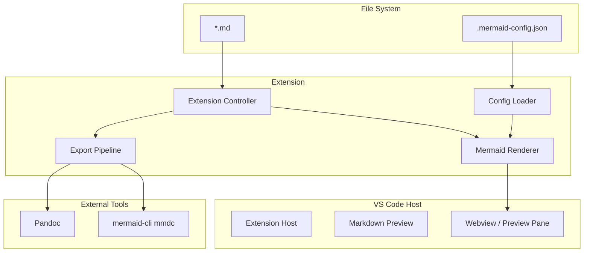

# ARCHITECTURE.md - システムアーキテクチャ設計書

## 1. アーキテクチャ概要

### システム概要
Markdown Mermaid Viewer は、VS Code 拡張として動作する。Markdown プレビュー内の Mermaid コードブロックを、プロジェクトの .mermaid-config.json に基づいて描画し、オプションで EPUB/PDF エクスポート時に図を画像化して埋め込む。

### アーキテクチャスタイル
- **採用パターン**: VS Code Extension（拡張ホスト内で実行、Webview または Markdown プレビュー拡張）
- **設計原則**: 設定の単一ソース（.mermaid-config.json）をプレビューとエクスポートで共有
- **通信**: 拡張 ↔ Webview は postMessage / 設定の受け渡し。エクスポート時は Node 子プロセスで Pandoc / mmdc を呼び出す

## 2. システム構成図

### 全体アーキテクチャ



### レイヤー構成（拡張内）

```
┌─────────────────────────────────────┐
│  Presentation (Webview / Preview)    │  Mermaid 描画表示
├─────────────────────────────────────┤
│  Application (Commands, Config)     │  設定読み込み、エクスポート制御
├─────────────────────────────────────┤
│  Domain (Mermaid Config Schema)     │  テーマ・themeVariables の型
├─────────────────────────────────────┤
│  Infrastructure (FS, Child Process)  │  .mermaid-config.json 読み取り、mmdc/Pandoc 実行
└─────────────────────────────────────┘
```

## 3. コンポーネント設計

### 主要コンポーネント
| コンポーネント名 | 責務 | 技術 | インターフェース |
|------------------|------|------|------------------|
| Config Loader | ワークスペースルートの .mermaid-config.json を読み取り、Mermaid 用設定に変換 | Node fs, JSON パース | getMermaidConfig(workspaceRoot): MermaidConfig |
| Mermaid Renderer | プレビュー用 HTML に Mermaid を初期化・描画（theme, themeVariables を適用） | Mermaid.js, Webview | render(markdown, config): string |
| Export Pipeline | Markdown を Pandoc に渡す前に Mermaid ブロックを画像化（mermaid-filter または mmdc） | Child process, mermaid-filter / mmdc | exportToEpub(inputPath, options): Promise\<void\> |
| Extension Controller | コマンド登録、プレビューへの設定注入、エクスポートトリガー | VS Code API | activate(context): void |

### 設定の流れ
1. ワークスペースを開いたとき、ルートから .mermaid-config.json を探索
2. 見つかった場合、その内容を Mermaid.initialize() に渡す（theme, themeVariables, themeCSS）
3. 見つからない場合、VS Code 設定（markdown-mermaid-viewer.*）またはデフォルト（neutral / base）を使用
4. エクスポート時は同じ .mermaid-config.json を mermaid-filter の cwd に置き、mmdc が参照する

## 4. データアーキテクチャ

### 設定ファイル
- **.mermaid-config.json**: Mermaid 公式の theme, themeVariables, themeCSS に準拠。プロジェクトルートに配置し、プレビューとエクスポートで共有する。
- **VS Code 設定**: 拡張用のフォールバック（テーマ名、エクスポート先パス等）を workspace または user で上書き可能にする。

### エクスポート時のデータフロー
1. Markdown ソース + .mermaid-config.json
2. mermaid-filter または 自前で Mermaid ブロックを抽出 → mmdc で SVG/PNG 生成
3. 画像を埋め込んだ中間 Markdown または HTML を Pandoc に渡す
4. Pandoc が EPUB/PDF を出力

## 5. 技術選定理由（ADR 概要）

| 決定事項 | 選定 | 理由 |
|----------|------|------|
| プレビュー実装 | Markdown プレビュー拡張 または カスタム Webview | VS Code 標準プレビューを拡張すると既存の Markdown 体験を維持できる。カスタム Webview は完全制御可能だが実装コストが高い。 |
| 設定の優先順 | ワークスペース .mermaid-config.json > VS Code 設定 > デフォルト | プロジェクトごとに見た目を揃え、エクスポートと一致させるため。 |
| エクスポート | mermaid-filter + Pandoc | 既存の Pandoc ワークフロー（EPUB/PDF）と組み合わせやすく、図の形式（SVG/PNG）を出し分け可能。 |
| 図の形式（EPUB） | PNG をデフォルト推奨 | Kindle 端末の SVG 対応が機種依存のため、互換性を優先。 |
| 図の形式（PDF） | SVG 推奨 | ベクターでシャープ。weasyprint 等でそのまま扱える。 |

詳細な ADR は [DECISIONS.md](../06-reference/DECISIONS.md) に記録する。

## 6. インフラ・デプロイ

### 拡張の配布
- **VS Code Marketplace**: vsce package で .vsix を生成し、publish または手動アップロード
- **依存**: ユーザー環境に Node が入っている必要があるのはエクスポート機能のみ。プレビュー単体では VS Code 拡張ホストの Node のみで動作する
- **mermaid-cli / Pandoc**: エクスポート利用時はユーザーがインストールする。拡張からは「未インストール時はエラーメッセージとインストール手順を表示」とする
