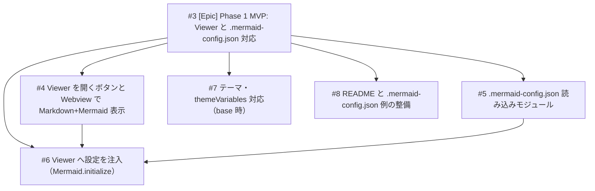

# DEVELOPMENT_PLAN.md - 開発計画と Issue 構成

本ドキュメントは Phase 1 MVP の開発計画と、親子関係を持つ GitHub Issue の構成を定義する。参照: [MASTER.md](../MASTER.md)、[ROADMAP.md](./ROADMAP.md)、[TASKS.md](./TASKS.md)。

**GitHub Issue 対応**: Epic が #3、子 Issue が #4〜#8 として作成済み（#3 = Epic、#4 = Viewer ボタン/Webview、#5 = 設定読み込み、#6 = 設定注入、#7 = themeVariables、#8 = README）。

---

## 1. プロジェクト確認サマリ

- **現状**: 拡張のスキャフォールドは完了（package.json、src/extension.ts、esbuild）。extension.ts は OutputChannel の作成のみで、Markdown プレビュー連携・設定読み込みは未実装。
- **目標（Phase 1）**: .md を開いたときに「Viewer を開く」ボタンがあり、クリックで VS Code 内の専用 Viewer（Webview）で Markdown + Mermaid を表示する。ワークスペースの .mermaid-config.json を読み込んでテーマ・themeVariables を適用する。
- **UX 方針**: 標準の Markdown プレビューを拡張するのではなく、**拡張が提供する専用 Viewer** をボタンから開く。Viewer は VS Code 内の Webview パネルで表示し、現在開いている .md の内容を描画する。

---

## 2. 親 Issue（Epic）と子 Issue の構成

以下のように **1 つの親 Issue（Phase 1 全体）** と **5 つの子 Issue（実装単位）** に分割する。括弧内は GitHub 上の Issue 番号。



- **#4 と #5** は並行可能。**#6** は #4・#5 に依存。
- **#7** は #6 の一部として実装してもよいが、別 Issue にするとレビューしやすい。
- **#6** は他と並行または最後に実施。

---

## 3. 各 Issue のスコープと受け入れ条件

### 親 Issue #3（Epic）

- **タイトル**: `[Epic] Phase 1 MVP: Viewer と .mermaid-config.json 対応`
- **説明**: ROADMAP Phase 1 の完了を表す親 Issue。.md を開いたときに Viewer を開くボタンがあり、VS Code 内の専用 Viewer で Markdown + Mermaid を確認できるようにする。子 Issue #4〜#8 がすべて完了したらクローズ。
- **ラベル**: リポジトリに `epic` ラベルがあれば付与

### 子 Issue #4: Viewer を開くボタンと Webview で Markdown + Mermaid 表示

- **目的**: .md ファイルを開いたときに「Viewer を開く」ボタンを表示し、クリックで VS Code 内の専用 Viewer（Webview パネル）を開き、Markdown と Mermaid コードブロックを描画する。
- **技術方針**:
  - コマンド: `markdownMermaidViewer.openViewer` を登録し、現在アクティブな .md の URI を受け取る。
  - ボタン: `contributes.menus` の `editor/title` にボタンを追加し、.md を開いているときだけ表示（`when: editorLangId == markdown` など）。
  - Viewer: `vscode.window.createWebviewPanel` で Webview パネルを作成し、Markdown を HTML に変換し、`` ```mermaid `` ブロックを Mermaid.js で描画する。
- **スコープ**: .md を開いた状態でエディタタイトルに「Viewer を開く」ボタンが表示され、クリックで Webview が開き現在の .md が Markdown + Mermaid として表示される。初回は固定のデフォルト設定（例: theme: neutral）でよい。
- **受け入れ条件**: .md を開きボタンから Viewer を開くと Markdown と Mermaid 図が表示される。描画エラー時は Viewer 内にメッセージ表示。
- **参照**: [ARCHITECTURE.md](../02-design/ARCHITECTURE.md)、[PATTERNS.md](../03-implementation/PATTERNS.md)。

### 子 Issue #5: .mermaid-config.json 読み込みモジュール

- **目的**: ワークスペースルートの `.mermaid-config.json` を読み、Mermaid 用の設定オブジェクトを返すモジュールを用意する。
- **技術方針**: [PATTERNS.md](../03-implementation/PATTERNS.md) の「ワークスペース設定の優先」に従う。定数は MERMAID_CONFIG_FILENAME、DEFAULT_MERMAID_THEME 等を CONVENTIONS に従って定義。
- **スコープ**: ワークスペースルート（または markdownMermaidViewer.configPath）から設定を読む。ファイル不在・JSON 不正時はデフォルトにフォールバックし、OutputChannel に警告。返却型は Domain の型（theme, themeVariables, themeCSS 等）に合わせる。
- **受け入れ条件**: ルートに .mermaid-config.json があるときその内容が返る。ないとき／壊れているときはデフォルトが返り、警告がログに出る。
- **参照**: [ARCHITECTURE.md](../02-design/ARCHITECTURE.md)、[PATTERNS.md](../03-implementation/PATTERNS.md)。

### 子 Issue #6: Viewer へ設定を注入（Mermaid.initialize）

- **目的**: #4 の Viewer と #5 の設定を接続し、Viewer を開いたときに .mermaid-config.json（と VS Code 設定）を Mermaid.initialize() に渡す。
- **技術方針**: Config Loader の結果を Webview に渡す（postMessage / 埋め込み JSON 等）。
- **スコープ**: Viewer 起動時（または設定変更時）に設定を再取得し、Mermaid に適用する。設定の優先順: ワークスペース .mermaid-config.json > VS Code 設定 > デフォルト。
- **受け入れ条件**: .mermaid-config.json の theme を変えると Viewer の見た目が変わる。設定ファイルを削除/壊すとデフォルトで描画される。
- **依存**: #4、#5 が完了していること。
- **参照**: [ARCHITECTURE.md](../02-design/ARCHITECTURE.md)、[PROJECT.md](../01-context/PROJECT.md)。

### 子 Issue #7: テーマ・themeVariables 対応（base 時）

- **目的**: 組み込みテーマ（default, neutral, dark, forest, base）と、base テーマ時の themeVariables を正しく扱う。
- **技術方針**: `theme === 'base'` のときのみ themeVariables を有効にする（Mermaid の仕様）。
- **スコープ**: Domain の設定型に themeVariables（と必要なら themeCSS）を含める。Viewer 側で base のときだけ themeVariables を渡す。
- **受け入れ条件**: theme: base かつ .mermaid-config.json に themeVariables を書くと色・フォント等が反映される。他テーマのとき themeVariables を書いても無視される（またはドキュメントで注記）。
- **参照**: [MASTER.md](../MASTER.md)、[PATTERNS.md](../03-implementation/PATTERNS.md)。

### 子 Issue #8: README と .mermaid-config.json 例の整備

- **目的**: インストール方法、Viewer の開き方、.mermaid-config.json の例、Phase 2 以降の予定を README に記載する。
- **スコープ**: README に概要・インストール・使い方（.md を開く → Viewer を開くボタン → 設定ファイルの置き場所）。.mermaid-config.json のサンプルを README 内または docs/ に記載。
- **受け入れ条件**: 新規ユーザーが README だけで拡張を試し、.mermaid-config.json を書ける程度の説明がある。
- **参照**: [ROADMAP.md](./ROADMAP.md)、[TASKS.md](./TASKS.md)。

---

## 4. 実装順序の推奨

| 順序 | Issue | 理由 |
|------|--------|------|
| 1 | #4 | Viewer ボタンと Webview で図が出ないと以降の検証ができない |
| 2 | #5 | #6 の前提。#4 と並行可能 |
| 3 | #6 | #4・#5 の結果を接続して「設定が効く Viewer」を実現 |
| 4 | #7 | #6 の延長。base + themeVariables の仕様をはっきりさせる |
| 5 | #8 | いつでも着手可能。他完了前でもドラフト可能 |

#7 は #6 の PR に含めてもよい。

---

## 5. GitHub での運用

- **親 Issue #3**: 本文に「この Issue は Phase 1 MVP の Epic です。以下の子 Issue がすべて完了したらクローズします」と書き、子 Issue #4〜#8 へのリンクを列挙する。
- **子 Issue #4〜#8**: 本文に「親 Issue: #3」と書き、上記のスコープ・受け入れ条件を貼る。ブランチは `feature/#4-...` のように Issue 番号を含める（[AGENTS.md](../../AGENTS.md) の Git Workflow に準拠）。
- **マイルストーン**: 「Phase 1 MVP」のようなマイルストーンを作り、#3 および #4〜#8 を紐づけると進捗が見やすい。

---

## 6. Kindle 互換 CSS（制約と Phase 3 機能）

### 制約としての明文化

- [CONSTRAINTS.md](../01-context/CONSTRAINTS.md) に次の制約を追加する（Phase 1 完了後または Phase 2 着手前を推奨）:
  - **Kindle 互換 CSS**: エクスポート結果（EPUB/HTML）および .mermaid-config.json の themeCSS は、Kindle（KDP）がサポートする CSS のサブセットに準拠することを推奨・目標とする。

### Phase 3 の機能: Kindle 対応 CSS チェック

- themeCSS やエクスポート用 CSS を解析し、Kindle がサポートしないプロパティ・値があれば警告または一覧表示する。Phase 3 の Epic を立てる際は、子 Issue の 1 つとして「Kindle で使える CSS のチェック機能」を切ることを推奨する。

---

## 7. Phase 3 で実現する Kindle レイアウト（参考サンプルとテンプレート）

添付した 2 つのサンプルは「この通りにしなければならない」ものではなく、デザインの幅を示す例とする。Phase 3 では **テンプレートの登録・選択** により、様々なデザインを選べるようにする。その一例として、2 サンプルを参考にした **同梱テンプレート** の実現可能性を検討する。

### サンプル A: 目次・章構成ページ

- 要素: Part バナー、Chapter 円バッジ、節番号ボックス、囲み数字、Column 枠、点線リーダー。
- 実現に必要な CSS: background-color, color, border-radius, border, font-weight, font-size, margin, padding, flex または表レイアウト。点線リーダーは端末依存のためテンプレートで 1 方式に固定し動作確認する。

### サンプル B: 本文ページ（章・節見出し）

- 要素: 章ヘッダー（「序章」枠＋章タイトル＋水平線）、大見出し（0.1, 0.1.1 等の枠＋節タイトル）、本文、ページ番号。オプションでウォーターマーク（要検証）。
- 実現に必要な CSS: 同上に加え border-bottom や hr。ウォーターマークは端末依存のためオプション／非推奨または画像で代替する方針を検討する。

### テンプレート登録・選択の考え方

- **目的**: 1 種類に固定せず、テンプレートを登録・選択できる仕組みで、技術書風・小説風・シンプル風などデザインの可能性を広げる。
- **同梱テンプレート**: 拡張に 1 つ以上の Kindle 用 HTML/CSS テンプレートを同梱する。新規 Kindle 本プロジェクト作成時やエクスポート時にテンプレートを選べる。
- **ユーザー提供テンプレート**（任意）: 設定またはプロジェクトでテンプレートのパスを指定し、自作 HTML/CSS を読み込めるようにする。Kindle 対応 CSS チェックで検証対象に含められる。
- Phase 3 の Epic では「テンプレートの登録・選択」を子 Issue の 1 つとして切り、同梱テンプレートの数・ユーザー提供テンプレートの対応範囲をスコープに含めるとよい。

---

## 8. Phase 2 以降について

- **Phase 2**: Phase 1 の親 Issue #1 がクローズしたあと、別の Epic「Phase 2: EPUB/PDF エクスポート」を立て、その下に「mermaid-filter 連携」「図の形式出し分け」「未インストール時の案内」などの子 Issue を切る形を推奨する。
- **Phase 3**: Kindle 互換 CSS の制約を CONSTRAINTS.md に反映し、Kindle 対応 CSS チェックを任意機能の子 Issue として実装する。テンプレートの登録・選択により様々なデザインを選べるようにし、同梱テンプレートの例として 2 つの参考サンプルを参考にした HTML/CSS で実現可能性を検証（Kindle Previewer 等）する。

本開発計画のスコープは Phase 1 に限定する。
