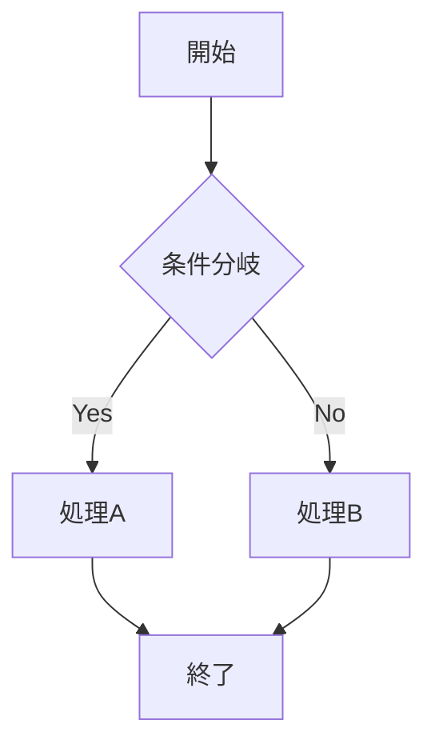
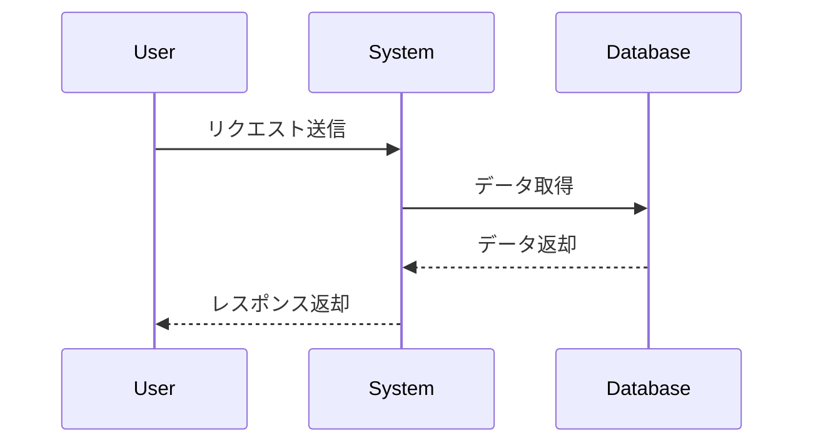
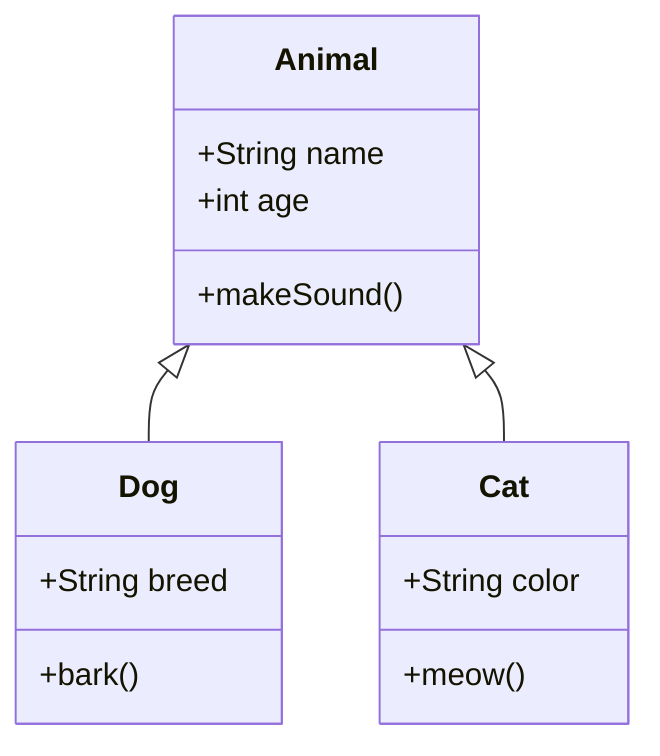

# Mermaid エクスポートテスト

このドキュメントは Phase 2 のエクスポート機能をテストするためのサンプルです。

## フローチャート

```mermaid
graph TD
    A[開始] --> B{条件分岐}
    B -->|Yes| C[処理A]
    B -->|No| D[処理B]
    C --> E[終了]
    D --> E
```

## シーケンス図

```mermaid
sequenceDiagram
    participant User
    participant System
    participant Database

    User->>System: リクエスト送信
    System->>Database: データ取得
    Database-->>System: データ返却
    System-->>User: レスポンス返却
```

## クラス図

```mermaid
classDiagram
    class Animal {
        +String name
        +int age
        +makeSound()
    }
    class Dog {
        +String breed
        +bark()
    }
    class Cat {
        +String color
        +meow()
    }
    Animal <|-- Dog
    Animal <|-- Cat
```

## まとめ

このドキュメントには 3 つの Mermaid 図が含まれています。EPUB/PDF エクスポート時に、これらが正しく画像として埋め込まれることを確認します。
